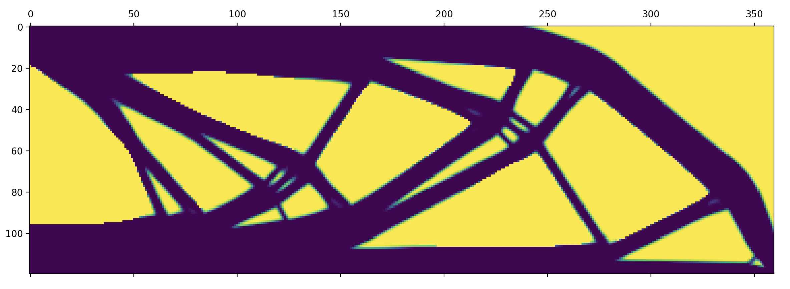

# PyTopOpt
A 2D topology optimization problem solver in python based on the 99 line matlab code

## About
During my curriculum at the Ecole Centrale de Lyon in france, I took a class on solid and structural mechanics, and I wanted to learn this topic more in depth, so I took on this project to understand how a basic topology problem solver could was developped using the SIMP method. The inspiration for this project came from [this video](https://youtu.be/3smr5CEdksc?si=qrlafq8mZ6PL_7od), but I didn't wanted to pay the cost of running the simulation to get some results for myself.

## How it works
### Description of the problem
Given a volume $V = H\times W$, a target fraction of the volume (ex : $\alpha = 40%$) and a set of forces on the boundary $\Omega V$ of the volume, what is the optimal density repartition $\chi$ of the volume to support theses constraints best ?

Namely the problem can be described by 

  

where $U$ is the displacement fields and $K$ is the $\textbf{global}$ displacement matrix

The easiest method I found was the SIMP (Solid Isotropic Material with Penalisation). For a real meaning, we must have $\chi \in \{0,1\}$, but that makes the problem really hard to solve, thus we choose to use a continuous variable $\chi \in \[0,1\]$, and then bring it bake to a binary value using a penalisation scheme that will multiply $\chi$ by a factor $p$ usually taken equal to 3 (a paper by Sigmund provides a low-bound for such a factor p in 2D and in 3D, but I don't remember which one).

### Optimisation loop

The program will thus calculate $\chi$ for the given $U, K$ and $F$, and then an updating scheme will change the value of $\chi$ based on the changes of the objective function

### The cherckerboard problem

Due to the problem being discrete instead of continuous (the equation works for continuous variable in space), a common phenomenon that appears is that the optimal structure will result in a checkerboard pattern of the selected element in the structure. Namely one element of the volume V will be considered full, and it's neighbors empty, but it's further neighbours will be filled, and it continues.

In order to avoid this pattern, a filter is applied that prevents it's formation.

## Results
I tested my code on the usual exemple of the cantilever 2D beam, using Q4 quadrilateral elements. The result is the following :

## A rust implementation ?
I tried implementing the solver in rust in order to achieve better efficiency, as well as learning this language. If the latter goal was fullfilled, I had a lot of trouble for the former due to the lack of popular library in rust for sparse matrix computation. I tried implementing it using the crates `faer`, `nalgebra` and `ndarray`, but didn't understood how to solve the sparse matrix computation with cholesky factorization using them. Each time the result of the solver was diverging, so I might need to understand better how rust works before fixing it.

## Workspace description
For the rust files, I didn't include the `cargo.toml`file as the programs aren't working anyway, but feel free to add the necessary crates if needed
- [`PytopologyOptimisation.py`](Python/PytopologyOpt.py) : Topology optimisation program. You can define the volume $V$ and the $\alpha$ at the end of the program, but for defining forces and fixed elements it is in the function that defines loads and support
- [`ke.rs`](Rust/ke.rs) : Allows to approximate the value of the element stiffness matrix using a 2D quadrilateral method for numerical integration. It was to be sure that I understood how it was computed, but it is way more efficient to do it using symbolic derivation and integration with `scipy`, or to use a gaussian quadrature method.
- [`topopt_faer.rs`](Rust/topopt_faer.rs) : Implementation test using the `faer`crate
- [`topopt_nalgebra.rs`](Rust/topopt_faer.rs) : Implementation test using the `nalgebra`crate
- [`topopt_ndarray.rs`](Rust/topopt_faer.rs) : Implementation test using the `ndarray`crate
- [Bibliography](bibliography) : The documentation I used to understand topology optimization 

